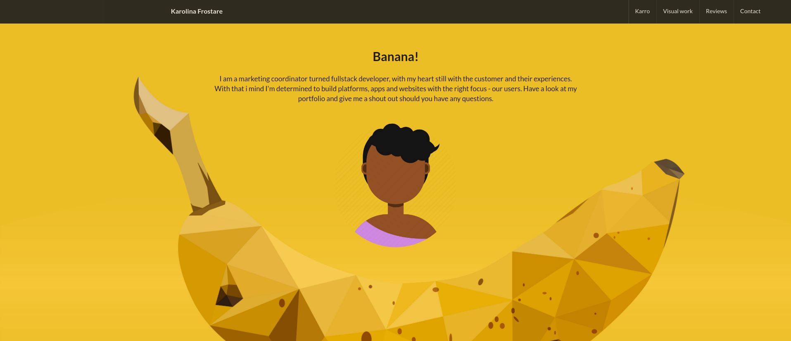

# [The Banana Portfolio](https://frostare.netlify.com/)
*This portfolio was created using React and launched using Netlify, click on the blue title to get there*

### You want a Banana Portfolio of your own?
Did you click the link? Do you like what you see? Maybe even a little jealous. That's ok - you can have one of your very own by just [Forking this Repo](https://github.com/kfrostare/React_Portfolio).

### Behind the scenes
The Banana Prtfolio has been created using ReactJS, React Router, NPM, Webpack and Semantic UI. Below are additional external people and places who also helped make this project possible.

### Thanks for
* An explanation on Stateful vs. Stateless by [Hussein Nasser](https://www.youtube.com/watch?v=nhwZn6v5vT0)
* An explanation on a Component Lifecycle by [Academind](https://www.youtube.com/watch?v=Oioo0IdoEls)
* An explanation on Components and Rendering by [LearnCode.academy](https://www.youtube.com/watch?v=fd2Cayhez58&t=4s)
* A beautiful background from [Pixabay](https://pixabay.com/)
* Cool templates from [Semantic UI](https://semantic-ui.com/)
* My cute Avatar from [IconFinder](https://www.iconfinder.com/)
* And of course Rubber ducking and coaching with [Jaime Cruz](https://github.com/JaimeCrz), thanks superman!

### Upcoming improvements
*I love my Banana portfolio, but we're not there yet. The following needs to be done before I'm taking the re-build sign off.*

* A stunning image carousel >> *Karro*
* More visual work from previous employments >> *Visual work*
* Adjustments in padding for project cards >> *Visual work*
* A cool couple of cards for my LinkedIn recommendations >> *Reviews*
* A beautiful and clean contact form >> *Contact* 
* A working footer, it is currently disabled for lack of self discipline >> *All pages*
* A chatbot pop-up asking if there is anything I can help with >> *All pages*

### Thanks for
MIT License

They say true friends are the ones who talk shit about you to your face and complements you behind your back.
              Well I forced my former colleagues to dish about some things they say when I'm not around and here are some of their stories.